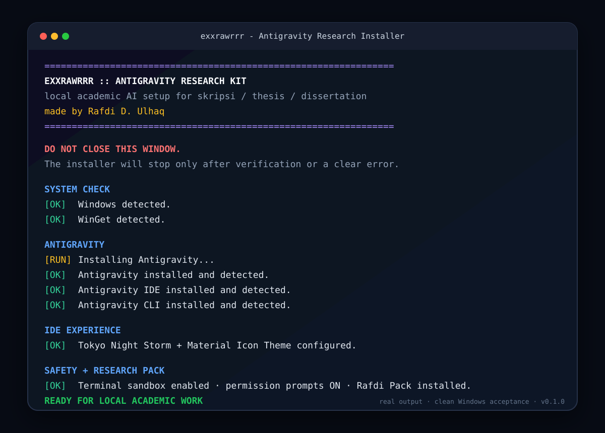

# Antigravity Research Kit

> **Antigravity setup + Rafdi Academic Research Pack**  
> Made by **Rafdi D. Ulhaq** / [@exxrawrrr](https://github.com/exxrawrrr)

A careful Windows installer that prepares Antigravity for local thesis, skripsi, dissertation, and academic-research work.

## Installer Preview

  

> **Runtime-faithful preview.** This image mirrors the actual `START.cmd` flow: Windows Terminal maximized + focus mode, vertical STEP 1/6 to 6/6 progress, status colors, completion card, and the post-install action panel.

## Download

Use the latest GitHub Release:

**https://github.com/exxrawrrr/antigravity-research-kit/releases/latest**

For non-developers: download the ZIP, extract it completely, then double-click **`START.cmd`**. It opens the premium Windows Terminal flow when available. `INSTALL.bat` remains the fallback/headless launcher.

See [QUICKSTART.md](QUICKSTART.md) for the short guide.

## What this project installs

- Antigravity 2.x
- Antigravity IDE
- Antigravity CLI (`agy`)
- Tokyo Night extension + **Tokyo Night Storm**
- Material Icon Theme
- Terminal sandbox / safer execution defaults where supported
- Request-review / permission-first defaults where supported
- **Rafdi Research role-skill**
- **Rafdi Document role-skill**
- **Rafdi Reviewer role-skill**
- Modular academic research and document helper skills

## Design principles

1. **Detect first, install second.** Existing compatible software is skipped.
2. **No blind overwrites.** Back up managed settings before editing.
3. **AI stays flexible.** Only three role-oriented capabilities; extra capability lives in on-demand skills.
4. **Reference-preserving research.** Keep academic claims traceable to sources.
5. **Learn formatting from examples.** Derive layout rules from a user-provided reference document.
6. **Local-first documents.** Work with local thesis/research files only with user permission.
7. **Visible installation.** Keep the terminal open until verification finishes.
8. **No credential copying.** Login, OAuth tokens, cookies, API keys, and private account state are never cloned from another machine.

## Beginner launchers

- `START.cmd` - recommended premium launcher; opens Windows Terminal maximized + focus mode when available.
- `INSTALL.bat` - first install or safe rerun
- `VERIFY.bat` - read-only health check
- `REPAIR.bat` - reapply missing managed pieces then verify
- `ROLLBACK-MANAGED-SETUP.bat` - restore managed settings/PATH and remove the Rafdi pack/launcher without uninstalling Antigravity itself

## How the research pack works

The pack uses progressive disclosure so the AI is not flooded with every instruction all the time.

- **Research** - broad academic research with source tracing.
- **Document** - local manuscript work and layout/formatting.
- **Reviewer** - strict academic QA.
- **Document Style Learning** - learns layout rules from a sample or official guideline.
- **Evidence Tracing** - keeps claims connected to verifiable references.

## Release

Current stable line: **v0.1.1**.

Release archives include an internal SHA256 manifest and a separate SHA256 checksum file for the ZIP.

## Attribution

Every Rafdi-authored skill includes: **Made by Rafdi D. Ulhaq**.

Third-party software keeps its original license and attribution. The kit prefers official package sources and does not bundle proprietary Antigravity binaries unless redistribution is explicitly permitted.
