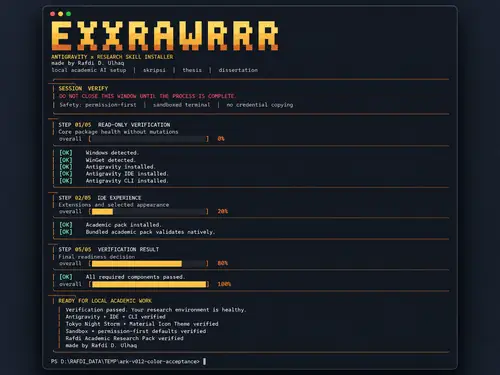

# Antigravity Research Kit

> **Antigravity setup + Rafdi Academic Research Pack**  
> Made by **Rafdi D. Ulhaq** / [@exxrawrrr](https://github.com/exxrawrrr)

A careful Windows installer that prepares Antigravity for local thesis, skripsi, dissertation, and academic-research work.

## Installer Preview

  

> **Premium terminal experience.** The interface uses the same charcoal + gold/amber + cream + mint visual system across install and verification, with live steps, progress, clear status tags, completion state, and a permission-first safety message.

The screenshot above shows the **read-only verification flow** ending in **READY FOR LOCAL ACADEMIC WORK**. The installer uses the same renderer while performing install/repair actions.

## Download

Use the latest packaged GitHub Release:

**https://github.com/exxrawrrr/antigravity-research-kit/releases/latest**

For non-developers:

1. Download the latest ZIP.
2. Extract it completely.
3. Double-click **`START.cmd`**.
4. Keep the terminal open until the process clearly finishes.
5. Complete official Antigravity/Google sign-in yourself if requested.
6. Use **`VERIFY.bat`** to run the read-only health check.

See [QUICKSTART.md](QUICKSTART.md) for the short guide.

> **Release status:** the latest packaged stable release is **v0.1.2**. Current `main` also contains post-v0.1.2 UX/CI hardening that will ship in the next tagged archive; the project does not pretend that unreleased code is already v0.1.3.

## What this project installs

- Antigravity 2.x
- Antigravity IDE
- Antigravity CLI (`agy`)
- Tokyo Night extension + **Tokyo Night Storm**
- Material Icon Theme
- Terminal sandbox / safer execution defaults where supported
- Request-review / permission-first defaults where supported
- **Rafdi Research role-skill**
- **Rafdi Document role-skill**
- **Rafdi Reviewer role-skill**
- Modular academic research and document helper skills

## Design principles

1. **Detect first, install second.** Existing compatible software is skipped.
2. **No blind overwrites.** Back up managed settings before editing.
3. **AI stays flexible.** Only three role-oriented capabilities; extra capability lives in on-demand skills.
4. **Reference-preserving research.** Keep academic claims traceable to sources.
5. **Learn formatting from examples.** Derive layout rules from a user-provided reference document.
6. **Local-first documents.** Work with local thesis/research files only with user permission.
7. **Visible installation.** Keep the terminal open until verification finishes.
8. **No credential copying.** Login, OAuth tokens, cookies, API keys, and private account state are never cloned from another machine.

## Beginner launchers

- **`START.cmd`** — recommended premium launcher; opens Windows Terminal maximized + focus mode when available.
- **`INSTALL.bat`** — direct install/safe-rerun entrypoint; delegates straight to the premium renderer instead of printing a second legacy banner.
- **`STATUS.cmd`** — current-main convenience alias for the read-only verifier; included by the current release builder for the next tagged archive.
- **`VERIFY.bat`** — read-only health check.
- **`REPAIR.bat`** — reapplies missing managed pieces and then verifies them.
- **`ROLLBACK-MANAGED-SETUP.bat`** — restores installer-managed settings/PATH and removes the Rafdi pack/launcher without uninstalling Antigravity itself.

## How the research pack works

The pack uses progressive disclosure so the AI is not flooded with every instruction all the time.

- **Research** — broad academic research with source tracing.
- **Document** — local manuscript work and layout/formatting.
- **Reviewer** — strict academic QA.
- **Document Style Learning** — learns layout rules from a sample or official guideline.
- **Evidence Tracing** — keeps claims connected to verifiable references.

## Safety contract

The installer is intentionally conservative:

- detects before installing,
- preserves compatible existing components,
- backs up managed settings before rewrite,
- keeps normal permission prompts enabled,
- never enables dangerous auto-approval,
- never copies credentials, cookies, OAuth tokens, or API keys from another machine,
- provides read-only verification and managed rollback paths.

## Release

Current packaged stable line: **v0.1.2**.

Release archives include an internal SHA256 manifest and a separate SHA256 checksum file for the ZIP. The current builder also includes README assets and all beginner launchers so the standalone archive remains self-contained.

## Attribution

Every Rafdi-authored skill includes: **Made by Rafdi D. Ulhaq**.

Third-party software keeps its original license and attribution. The kit prefers official package sources and does not bundle proprietary Antigravity binaries unless redistribution is explicitly permitted.
